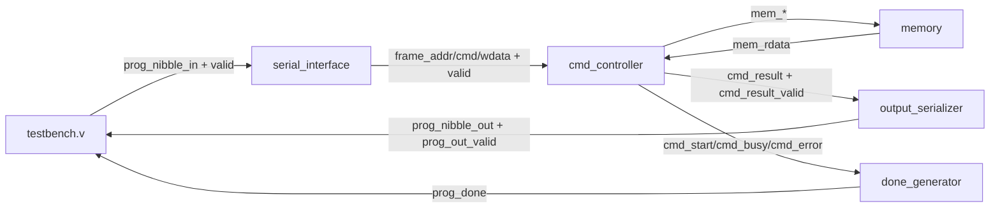

# 01 Lab — Serial-Programmed Command Controller (SV/V)

A small SystemVerilog/Verilog design that accepts a **nibble-serial programming stream**, forms command frames, performs **memory operations**, and (for read-like commands) returns results as **nibble-serialized output**.

---

## Repository layout

- [cpu_top.sv](cpu_top.sv) — top-level integration: [`cpu_top`](cpu_top.sv)
- [serial_interface.sv](serial_interface.sv) — frame builder: [`serial_interface`](serial_interface.sv)
- [cmd_controller.sv](cmd_controller.sv) — command FSM + memory interface: [`cmd_controller`](cmd_controller.sv)
- [output_serializer.sv](output_serializer.sv) — 32-bit to nibble stream: [`output_serializer`](output_serializer.sv)
- [done_generator.sv](done_generator.sv) — `prog_done` pulse generation: [`done_generator`](done_generator.sv)
- [memory.v](memory.v) — simple synchronous memory model: [`memory`](memory.v)
- [testbench.v](testbench.v) — stimulus: [`testbench`](testbench.v)
- [01_lab.md](01_lab.md) — lab handout (currently empty)

Simulation artifacts:
- [transcript](transcript)
- [vsim.wlf](vsim.wlf)

---

## High-level architecture



---

## Interfaces (what to look at in waves)

Top-level module: [`cpu_top`](cpu_top.sv) in [cpu_top.sv](cpu_top.sv)

### Programming input (into [`serial_interface`](serial_interface.sv))
- `prog_nibble_in[3:0]`
- `prog_nibble_in_valid`

A **frame** is assembled as:
- Address: 3 nibbles (12-bit)
- Command: 2 nibbles (8-bit)
- Write data: 8 nibbles (32-bit)

> Nibble order is **LSB-first** as implemented by [`serial_interface`](serial_interface.sv).

### Output stream (from [`output_serializer`](output_serializer.sv))
- `prog_nibble_out[3:0]`
- `prog_out_valid`

For result-producing commands (e.g., READ), the 32-bit value is returned as **8 nibbles, LSB-first**.

### Done pulse (from [`done_generator`](done_generator.sv))
- `prog_done`

`prog_done` pulses on command completion (width depends on success/error logic in [`done_generator`](done_generator.sv)).

---

## How to run (Questa/ModelSim)

### Compile + run (CLI)
```sh
vlog -sv cpu_top.sv serial_interface.sv cmd_controller.sv output_serializer.sv done_generator.sv
vlog memory.v testbench.v
vsim -c testbench -do "run -all; quit"
```

### Run with waves
```sh
vsim testbench -do "log -r /*; add wave -r /*; run -all"
```

---

## Testbench scenario

The provided stimulus in [`testbench`](testbench.v) (see [testbench.v](testbench.v)) exercises:
- `CMD_WRITE` to initialize memory locations
- arithmetic command(s)
- `CMD_READ` to stream results back out on `prog_nibble_out/prog_out_valid`

---

## Images (add these to the repo)

Place screenshots/diagrams under `docs/images/` and commit them.

### 1) Block diagram


### 2) Waveform (programming + readback)


### 3) Example output nibble stream (READ)


Suggested captures:
- `prog_nibble_in`, `prog_nibble_in_valid`
- `frame_valid`, `frame_ready`, `frame_addr`, `frame_cmd`, `frame_wdata`
- `cmd_busy`, `cmd_result_valid`, `cmd_result`
- `prog_nibble_out`, `prog_out_valid`, `prog_done`
- `mem_addr`, `mem_wen`, `mem_cen`, `mem_wdata`, `mem_rdata`

---

## Notes

- The memory model [`memory`](memory.v) in [memory.v](memory.v) is synchronous (read data updates on `posedge clk` when `cen=1` and `wen=0`).
- The serializer in [`output_serializer`](output_serializer.sv) shifts out **nibbles** with `prog_out_valid` asserted while active.

---

## License

Add a license if required by your course/lab policy.